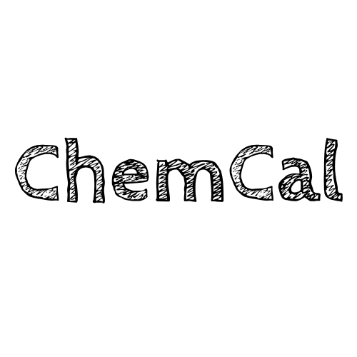

<!-- markdownlint-disable -->

<div align="center">



# ChemCal · 化算

<br>
<div>
    
    
    
</div>
<div>
    
    
</div>
<br>

化工工程师的桌面生产力工具

基于 Python + PySide6，集成 45 种工程计算器、参考资料库、单位换算、计算历史与可视化倒计时。

</div>

## 下载与安装

前往 [Releases](https://github.com/virmuran/ChemCal/releases) 下载最新版 `ChemCal_vX.X.X.exe`，双击即可运行，无需安装 Python 环境。

如需从源码运行：

```bash
git clone https://github.com/virmuran/ChemCal.git
cd ChemCal
pip install -r requirements.txt
python main.py
```

## 亮点功能

- 🧪 **45 种工程计算器** — 覆盖物性查询、管道系统、换热设备、容器设计、安全消防、制冷热工六大类，每个计算器均支持 DOCX / PDF 计算书一键导出，公式均对照 GB / HG / NB/T 等标准逐项核对并固化回归测试
- 📚 **内置参考资料库** — 化工设计常用规范数据电子化，全文搜索，6 大类 26 条数据，告别翻书查表
- 🔄 **14 类单位换算** — 长度、重量、温度、压力、流量、粘度等，即输即算
- 📝 **自动计算历史** — SQLite 数据库全程记录，支持按模块筛选和关键词搜索
- 🎨 **三套主题配色** — 亮色 / 暗色 / 蓝色，白天办公不刺眼，夜间低光不伤眼
- 🔒 **数据本地存储** — 不联网、不上传、不收集任何隐私信息，所有数据仅保存在用户目录 `.ChemCal/` 下

<!-- markdownlint-disable -->

<details><summary>点我看截图</summary>

<p align="center">
  <em>截图待补充 — 欢迎提交 PR！</em>
</p>

</details>

<!-- markdownlint-restore -->

## 使用说明

### 工程计算

启动后默认进入「工程计算」标签页，左侧导航树按六大类展开，点击即可进入对应计算器。输入参数后点击绿色「计算」按钮，结果实时显示；点击底部「下载 DOCX」或「下载 PDF」导出计算书。

### 参考资料库

切换到「资料库」标签页，左侧按分类浏览，顶部搜索栏支持全文关键词匹配。数据来源标注 GB / HG / TSG / API 规范编号，方便溯源。

### 计算历史

每次计算自动存入「计算历史」标签页，可按计算器类型筛选、按关键词搜索，点击查看完整输入输出详情。

### 自动更新

启动时自动检查 GitHub Releases，发现新版本后状态栏提示，点击一键下载安装。

## 加入我们

### 主要关联项目

- 本项目基于 [ChemCal](https://github.com/virmuran/ChemCal) 持续迭代
- 化工计算核心：[IAPWS-IF97](http://www.iapws.org/) 工业用水蒸气性质标准
- PDF 报告：[fpdf2](https://github.com/py-pdf/fpdf2) / [ReportLab](https://www.reportlab.com/)
- DOCX 报告：[python-docx](https://github.com/python-openxml/python-docx)
- GUI 框架：[PySide6](https://wiki.qt.io/Qt_for_Python)

### 参与开发

欢迎提交 Issue 和 Pull Request！

- **代码规范**：中文注释 + Python 类型注解
- **新增计算器**：参照 `modules/chemical_calculations/calculators/` 中的现有实现，继承 `CalculatorBase`
- **新增参考数据**：按 `data/reference_db.json` 格式追加条目

### 贡献/参与者

感谢所有参与到开发中的朋友们！

[](https://github.com/virmuran/ChemCal/graphs/contributors)

## 致谢

### 开源库

- GUI 框架：[PySide6](https://wiki.qt.io/Qt_for_Python)
- 数值计算：[NumPy](https://github.com/numpy/numpy) / [SciPy](https://github.com/scipy/scipy)
- PDF 生成：[fpdf2](https://github.com/py-pdf/fpdf2) / [ReportLab](https://www.reportlab.com/)
- DOCX 生成：[python-docx](https://github.com/python-openxml/python-docx)
- 日志系统：[Loguru](https://github.com/Delgan/loguru)
- 系统监控：[psutil](https://github.com/giampaolo/psutil)
- 打包工具：[PyInstaller](https://github.com/pyinstaller/pyinstaller)

### 数据源

- 水蒸气性质：IAPWS-IF97 工业标准
- 制冷剂物性：Peng-Robinson 状态方程 + REFPROP 参考数据
- 设计规范：GB 150 / GB 50316 / GB 50974 / HG/T 20570 / TSG 21 / API 520 等

## 更新日志

### v1.5.50 (2026-09-14)

- ✅ **全量公式核对收官**：45 个计算器的公式、单位、默认值逐批对照 GB 150 / GB 50341 / GB/T 20801 / HG/T 20592 / IAPWS-IF97 / GB 30000 (GHS) 等标准核对修正，19 个回归测试文件固化手算锚点
- ➕ **恢复「常压储罐壁厚」计算器**（工艺设备类）：GB 50341 一英尺法逐圈计算 + NB/T 47003，固定顶/浮顶/内浮顶，底板顶板厚度
- ➖ **移除「法兰查询」演示模块**：原数据仅 4 条 DN100 且与管道间距计算器重复，法兰外径权威数据（PN10~100 × DN10~500）保留于管道间距计算器
- 🛠 **安全阀**：修复 Kd 阀型映射错位（"不带调节圈微启式"误填 0.45，正确 0.30）及初始化顺序异常
- 🛠 **查询类修正**：危险化学品 GHS 分类按 GB 30000 核对（硫酸不再标"毒性物质"，补全 H 语句）；腐蚀速率等级由速率唯一派生（左景伊 4 级制）；发酵废水 COD 物料平衡重复计入修复；L-蛋氨酸 COD 当量 1.073→1.609（含硫氨基酸）
- 🛠 水蒸气物性 steam_iapws 对照 IAPWS-IF97 官方验证表全网格校验（偏差 ≤0.04%），高压区判域修正

### v1.5.0 (2026-07-14)

- 新增自动更新系统（GitHub Releases API + 静默检测 + 一键下载安装）
- 补充缺失的 fpdf2 依赖

### v1.4.20260623 (2026-06-23)

- 新增发酵搅拌功率、蒸汽空消、发酵废水 COD 估算、蒸汽管道压降/温降、法兰尺寸、夹套/盘管换热、容器贮罐设计、消防水池容积 8 个计算器

### v1.4 (2026-06-02)

- 新增「参考资料库」标签页，全文搜索 + 树形导航
- 循环水计算器增强：多效蒸发器、结晶罐分项计算

### v1.3 (2026-06-01)

- DOCX 报告导出（替代 TXT）、安全阀模式驱动重构、防闪退保护层

### v1.2

- 查询类计算器、历史记录系统

### v1.1

- 水蒸气性质模块、日志系统

### v1.0

- 初始版本发布

## 项目结构

```
ChemCal/
├── main.py                     # 主入口，窗口框架与菜单
├── crash_shield.py             # 防闪退保护层 + 看门狗
├── launcher.py                 # 启动器（异常重启）
├── data_manager.py             # 数据管理（JSON 单例）
├── theme_manager.py            # 主题管理（亮色 / 暗色 / 蓝色）
├── module_loader.py            # 模块动态加载器
├── history_db.py               # 历史记录（SQLite）
├── updater.py                  # 自动更新（GitHub Releases）
├── version.py                  # 版本号定义
├── requirements.txt
├── ChemCal.ico                 # 应用图标
├── ChemCal.png                 # Logo
│
├── data/                       # 数据文件
│   └── reference_db.json       # 参考资料库
│
├── utils/                      # 公共工具
│   ├── __init__.py
│   └── docx_utils.py           # DOCX 报告生成（ReportExporter）
│
├── scripts/                    # 维护脚本
│   └── migrate_reports.py      # 批量迁移导出方法
│
├── modules/
│   ├── chemical_calculations/
│   │   ├── calculators/        # 45 个计算器
│   │   │   ├── steam_property_calculator.py
│   │   │   ├── pressure_drop_calculator.py
│   │   │   ├── heat_exchanger_area_calculator.py
│   │   │   ├── cooling_water_calculator.py  # 循环水（多效蒸发 / 结晶罐）
│   │   │   ├── agitator_calculator.py       # 搅拌功率 & kLa
│   │   │   ├── vessel_design_calculator.py   # 容器设计（GB 150）
│   │   │   └── ...
│   │   ├── steam_iapws.py      # IAPWS-IF97 水蒸气物性
│   │   ├── refrigerant_eos.py  # 制冷剂 PR 状态方程
│   │   └── chemical_calculations_widget.py
│   │
│   ├── reference/              # 参考资料库
│   ├── converter/              # 单位换算器（14 类）
│   ├── history_viewer.py       # 计算历史
│   └── countdowns.py           # 倒计时
│
└── docs/                       # 文档（计划中）
```

## 免责声明

计算结果仅供参考，实际工程应用请由专业工程师审核确认。本软件开源、免费，仅供学习交流使用。

## 许可证

[MIT License](LICENSE) © 2025-2026 ChemCal Team

联系方式：virmuran@163.com
